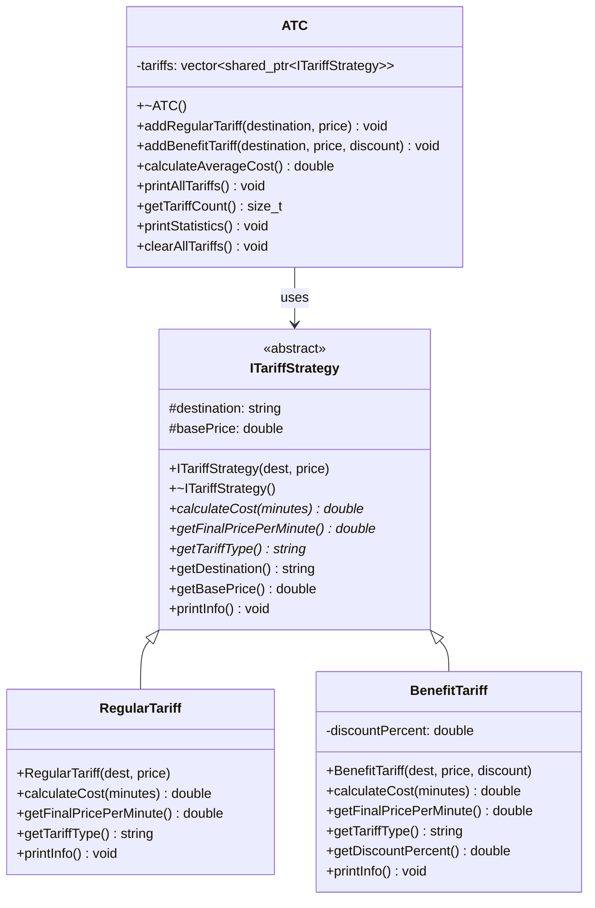

# Лабораторная работа №3: Наследование, полиморфизм и шаблоны проектирования

## Описание
Реализация системы управления тарифами АТС (Автоматическая Телефонная Станция) с использованием паттерна проектирования Strategy, наследования и полиморфизма.

## Вариант
**Вариант 21(1) ATC** - Система управления тарифами для междугородних разговоров

## Цель работы
- Изучение паттерна проектирования Strategy
- Практическое применение наследования и полиморфизма
- Реализация интерфейсных классов
- Обработка исключений

## Архитектура решения

### Используемые паттерны проектирования
- **Strategy Pattern** - для реализации различных типов тарифов
- **Interface Segregation** - через абстрактный базовый класс ITariffStrategy

### Структура классов

#### Базовый интерфейс
- `ITariffStrategy` - абстрактный базовый класс для всех типов тарифов

#### Конкретные реализации
- `RegularTariff` - обычный тариф без скидок
- `BenefitTariff` - льготный тариф со скидкой

#### Основной класс
- `ATC` - класс для управления тарифами и выполнения операций

## Функциональность

### Основные возможности
1. **Добавление тарифов:**
   - Обычные тарифы (без скидок)
   - Льготные тарифы (со скидкой)

2. **Управление тарифами:**
   - Просмотр всех тарифов
   - Расчет средней стоимости
   - Статистика по типам тарифов
   - Очистка всех тарифов

3. **Валидация данных:**
   - Проверка корректности названий городов
   - Валидация цен и размеров скидок
   - Обработка исключений

### Особенности реализации
- **Полиморфизм:** Использование виртуальных функций для различных типов тарифов
- **Наследование:** RegularTariff и BenefitTariff наследуются от ITariffStrategy
- **Инкапсуляция:** Приватные поля и публичные методы
- **Обработка исключений:** Comprehensive error handling с try-catch блоками

## Диаграмма классов



## Компиляция и запуск

### Требования
- C++11 или выше
- Компилятор с поддержкой STL

### Компиляция
```bash
g++ -std=c++11 -o atc main.cpp
```

### Запуск
```bash
./atc
```

## Пример использования

### Инициализация
Программа автоматически загружает тестовые данные:
- Москва: 2.50 руб/мин (обычный)
- Санкт-Петербург: 2.30 руб/мин (обычный)
- Минск: 1.80 руб/мин со скидкой 15% (льготный)
- Киев: 2.00 руб/мин со скидкой 20% (льготный)

### Меню программы
1. Добавить обычный тариф
2. Добавить льготный тариф
3. Показать все тарифы
4. Показать среднюю стоимость
5. Показать статистику
6. Очистить все тарифы
0. Выход

## Обработка ошибок

### Типы исключений
- `std::invalid_argument` - некорректные входные данные
- `std::runtime_error` - ошибки выполнения

### Валидация входных данных
- Названия городов: только буквы, пробелы и дефисы (1-50 символов)
- Цены: положительные числа (0.01 - 1000.0 руб)
- Скидки: 0-100%

## Технические особенности

### Используемые STL контейнеры
- `std::vector` - для хранения тарифов
- `std::shared_ptr` - для управления памятью
- `std::string` - для работы со строками

### Алгоритмы
- Автоматический расчет стоимости с учетом скидок
- Статистический анализ тарифов
- Валидация пользовательского ввода

## Результаты работы

### Демонстрация паттернов
- **Strategy Pattern:** Различные алгоритмы расчета стоимости
- **Polymorphism:** Единый интерфейс для разных типов тарифов
- **Inheritance:** Переиспользование кода через наследование

### Практические навыки
- Работа с абстрактными классами
- Реализация виртуальных функций
- Обработка исключений
- Валидация пользовательского ввода
- Управление памятью через умные указатели

## Файлы проекта
- `main.cpp` — исходный код с классами и меню
- `diagram.jpg` — диаграмма классов
- `README.md` — документация проекта

## Заключение
Лабораторная работа демонстрирует практическое применение объектно-ориентированного программирования в C++ с использованием современных паттернов проектирования и принципов SOLID.